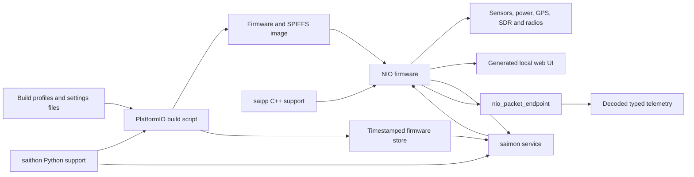

# SpaceAI firmware system analysis

## Executive summary

The code began as a single ESP32 firmware project and evolved into a small device-management ecosystem. The final result is not only firmware: it includes a portable C++ support layer, build-time product configuration, a local device administration interface, persistent and remotely managed settings, telemetry and datalog pipelines, several physical communication channels, OTA firmware delivery, automatic rollback, per-device update selection, and Python services that connect the build output to deployed NIO devices.

The central architectural change was the transformation of settings from constants compiled into `main.cpp` into a control plane shared by the firmware, its web interface, its build system, and the remote backend. This made hardware assignments, power policy, communications, sensing, logging, packet format, scheduling, and deployment behavior configurable without producing a custom source-code branch for every device.

## Measured scope

The two main repository histories contain 693 commits from November 2022 through November 2024. The original repository contains 374 commits; the successor workspace contains 319. The supporting repositories add their own histories: 74 commits in `saipp`, 18 in `saithon`, and 38 in `saimon`.

The final first-party implementation reviewed here contains approximately 8,986 physical lines across 81 C++ and Python source files:

| Component | Files | Physical lines | Role |
| --- | ---: | ---: | --- |
| `nio_firmware/src` | 62 | 7,758 | Device firmware and local administration |
| `saipp` | 11 | 789 | Portable C++ platform, filesystem, timing, strings, SPI and diagnostics |
| `saithon` | 5 | 99 | Shared paths, timestamps, Git/build and HTTP helpers |
| `saimon` | 1 | 185 | Remote settings, state history and firmware delivery service |
| `nio_packet_endpoint` | 2 | 155 | HTTP telemetry ingress and binary packet decoder |

These counts exclude bundled third-party sources, Python virtual environments, generated data, configuration profiles, UI assets, upload binaries, and build scripts. They measure implementation size rather than total deliverable size.

## What the system ended up including

- ESP32, ESP32-S2, ESP32-S3 and product-specific build environments.
- Full and reduced firmware variants, including cold-chain, bracelet, drone, mini, Enphase and SDR-oriented configurations.
- Runtime GPIO, UART, I2C address, reset, power and peripheral configuration.
- Wi-Fi station and access-point modes, static addressing, DHCP selection, DNS, hotspot/repeater behavior and NTP time.
- GPS acquisition and persistence, IMU control, ADS sensor channels, battery and board I/O expanders, Enphase gateway acquisition and SDR scheduling.
- LoRa/RN2903A, Iridium, Swarm, Modbus, HTTP/HTTPS and Wi-Fi telemetry paths.
- Binary datalogs, replay of pending records, JSON conversion, optional CCSDS packets and configurable packet sections.
- Deep-sleep state transitions, separate sleep profiles, differentiated success/retry wake intervals and NVS persistence.
- A local authenticated web interface that generates forms from serialized settings groups and exposes status APIs.
- Remote per-device settings synchronization, history of changed settings, server-time correction and device state collection.
- OTA firmware selection, timestamped builds, progress/error handling, rollback and suppression of a firmware image known to have failed.
- A Python decoder for the compact wire protocol, including packet identity, record status and typed GPS, IMU, capacity and ADS sections.
- Reusable C++ and Python libraries extracted from the application as the architecture matured.

## Documents

- [System evolution](D:/dev_extras/analysis/spaceai-firmware/system-evolution.md)
- [Final system inventory](D:/dev_extras/analysis/spaceai-firmware/final-system-inventory.md)
- [Settings and remote management](D:/dev_extras/analysis/spaceai-firmware/settings-and-remote-management.md)
- [Packet endpoint](D:/dev_extras/analysis/spaceai-firmware/packet-endpoint.md)
- [Development lineage from the early engines and games to gpk, llc and the firmware](D:/dev_extras/analysis/spaceai-firmware/lineage-from-gpftw-to-firmware.md)
- [Why use this architecture instead of React, Unreal, Unity or Godot?](D:/dev_extras/analysis/spaceai-firmware/architecture-versus-frameworks.md)

## Sources reviewed

- `D:/dev_extras/Firmware_Main_SpaceAI`
- `D:/dev_extras/FirmwareWorks/nio_firmware`
- `D:/dev_extras/FirmwareWorks/saipp`
- `D:/dev_extras/FirmwareWorks/saithon`
- `D:/dev_extras/FirmwareWorks/saimon`
- `D:/dev_extras/FirmwareWorks/nio_packet_endpoint`
- `firmware_main_spaceai.log` and `firmwareworks.log`

The review deliberately omits credential values found in configuration files. Some archived settings contain material that appears suitable for authentication and should be removed or rotated before the repository or this analysis is published.
