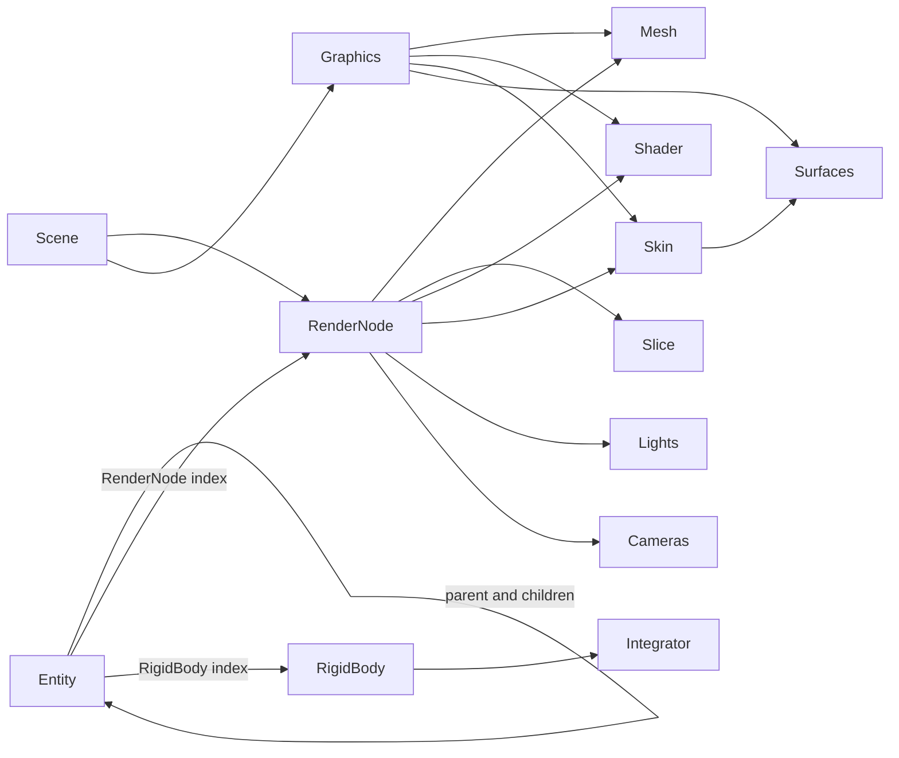

# Why use this architecture instead of React, Unreal, Unity or Godot?

## The central distinction: the application owns the architecture

The main reason is control over the program's model and execution. In React, Unreal, Unity and Godot, the framework owns a substantial part of the application and calls application code at designated points.

```text
Typical framework

    framework runtime
        +-- owns an object or component tree
        +-- controls creation and destruction
        +-- schedules updates and rendering
        +-- serializes framework objects
        `-- calls application callbacks


This architecture

    application
        +-- owns state and storage
        +-- explicitly performs setup, update and drawing
        +-- decides lifetime and scheduling
        +-- selects representations and configuration
        `-- calls llc, gpk and platform libraries
```

This is a library-centered architecture. Libraries provide operations and representations, but the program retains control of its state, lifetime and execution order. That distinction affects nearly every development and operating cost.

It also produces an important asymmetry: a library that makes few assumptions about its host can be compiled into a framework project, called from a service, used by firmware or linked into an ordinary executable. A framework normally integrates other code by making that code enter the framework's build, runtime and lifecycle model.

## Avoid translating the problem into somebody else's object model

Each popular framework establishes a vocabulary in which the application is expected to be expressed:

| Framework | Architectural vocabulary |
| --- | --- |
| React | Components, props, state, hooks and render trees |
| Unreal | `UObject`, Actor, Component, World, Level and gameplay-framework classes |
| Unity | `GameObject`, Component, `MonoBehaviour`, Scene and event functions |
| Godot | Node, Scene, SceneTree, Resource and signal |
| This architecture | Structures representing the actual problem, arrays, views, settings, events and explicit operations |

React recursively calls components after state changes and then commits the resulting differences to the DOM. That works well when the product naturally is a complex interactive component tree. It is additional machinery when the problem is simply to turn typed settings into controls, transmit changed values and store them. React documents this process in [Render and Commit](https://react.dev/learn/render-and-commit).

Unity describes every object in a game as a `GameObject` whose behavior is implemented by attached components. `MonoBehaviour` scripts receive predefined callbacks for frame updates, physics and lifetime events. [Introduction to GameObjects](https://docs.unity3d.com/6000.0/Documentation/Manual/GameObjects.html) and [Event functions](https://docs.unity3d.com/6000.0/Documentation/Manual/event-functions.html) therefore describe part of the architecture into which application code must fit.

Unreal goes further. Gameplay is expressed through Actors, Components, Pawns, Controllers, Game Modes, Game States and the `UObject` system. Actors and components are registered, activated, initialized, ticked, replicated and destroyed through an extensive engine-managed lifecycle. [Actors in Unreal Engine](https://dev.epicgames.com/documentation/unreal-engine/actors-in-unreal-engine) makes that ownership model visible.

Godot is lighter, but its normal unit remains the Node inside a SceneTree. The SceneTree manages the node hierarchy, scenes and main loop; the engine invokes processing and lifecycle methods and delivers signals. [SceneTree](https://docs.godotengine.org/en/stable/classes/class_scenetree.html) describes it as the engine's default main-loop implementation.

The projects examined here do not need to turn a setting, packet, entity, GPIO assignment or temporary operation into a framework object before it can exist.

## Complexity is available without becoming compulsory

The distinction is not “simple code cannot contain trees.” `gpk_engine` contains a substantial entity tree and several related graphs because a game engine actually needs them.

Its central relationships include:



`SVirtualEntityManager` stores entities, names and child collections. Every `SEntity` independently identifies its parent, render node and rigid body. `SetParent()` maintains both the child's parent field and the old and new parents' child collections. The hierarchy can be saved and loaded, including entity names and variable child lists.

`SEngine::Update()` begins at root entities and `updateEntityTransforms()` recursively propagates transforms through the hierarchy. A child's world transform can combine its rigid-body transform with the parent entity's render-node transform or physics transform. The traversal consequently joins three distinct domains: entity organization, simulation and rendering.

The render relationship is itself decomposed. `SRenderNode` identifies a mesh, slice, shader and skin, while `SRenderNodeManager` stores flags, current and base transforms, lights and cameras in parallel indexed storage. `SEngineGraphics` separately manages buffers, surfaces, meshes, skins, shaders and fonts. Hierarchical cloning can copy an entity subtree while independently deciding whether skins, surfaces and shaders should also be cloned.

The planetary-system adapter demonstrates that this is not a nominal tree. It constructs semantic chains among orbit entities, gravity centers and bodies, maps simulation orbiters to engine entities, and then relies on ordinary parent/child propagation. Game code can build still different structures, such as articulated cranes, wheels, bars, grips, ship cores and rings.

These relationships are at least structurally richer than the application-facing React component tree: they cover hierarchy, transforms, physical bodies, render resources, lights, cameras, cloning and persistence rather than primarily describing UI composition. React's internal implementation is itself sophisticated; the useful comparison concerns what the application must represent, rather than which codebase contains more algorithms.

The architectural advantage is that this complexity remains **local and earned**:

- Firmware settings do not have to become engine entities.
- A byte view does not have to become a scene node.
- A packet decoder does not inherit a rendering lifecycle.
- A command-line tool does not carry the entity manager.
- A game that needs a hierarchy can use the hierarchy together with the same low-level arrays, views, errors and serialization used elsewhere.

The architecture therefore permits complicated trees and cross-linked graphs without declaring a universal “everything is a node” rule. Complexity is introduced by the domain that requires it and stays out of programs that do not.

## The libraries follow the data across domains

The same `llc` concepts--views, caller-owned storage, arrays, strings, errors and serialization--remain useful in:

- Firmware.
- Native Windows applications.
- Linux/XCB applications.
- CGI and generated web frontends.
- Network protocols.
- Games and simulations.
- Command-line tools.
- Python-facing backend systems.

An Unreal Actor is primarily useful inside Unreal. A React component is primarily useful inside a React UI. A Godot Node belongs to a Godot scene tree. A view over caller-owned storage remains useful almost everywhere.

This gives the low-level code a larger reuse radius. `llc` does not merely avoid implementing another container. It lets programs in unrelated domains share ownership, error-handling, representation and serialization rules.

## Coexistence is stronger than framework extensibility

The established frameworks can integrate external code, so saying that they literally cannot integrate would be inaccurate:

- React officially supports adding isolated React roots to an existing page. It nevertheless requires a JavaScript module/package environment for ordinary development, and React owns rendering inside each selected root. See [Add React to an Existing Project](https://react.dev/learn/add-react-to-an-existing-project).
- Unity supports native C and C++ plugins, but they are imported into a Unity project, exposed through a C interface, called from C#, configured for target platforms and loaded by the Unity Player. See [Native plug-ins](https://docs.unity3d.com/6000.0/Documentation/Manual/plug-ins-native.html).
- Unreal supports external libraries through UnrealBuildTool modules and plugins. The library enters Unreal's module rules, staging, packaging and platform conventions. See [Integrating Third-Party Libraries into Unreal Engine](https://dev.epicgames.com/documentation/unreal-engine/integrating-third-party-libraries-into-unreal-engine).
- Godot supports C and C++ libraries through modules and GDExtension bindings, which deliberately expose the Godot API and require compatibility with the selected Godot build. See [About godot-cpp](https://docs.godotengine.org/en/stable/tutorials/scripting/cpp/about_godot_cpp.html).

These facilities prove that the frameworks are extensible. They do not make the integration relationship symmetrical.

```text
llc or similarly independent code

    ordinary executable  ---> can use it
    Unreal plugin        ---> can use it
    Unity native plugin  ---> can use it
    Godot extension      ---> can use it
    firmware             ---> can use it
    server or tool       ---> can use it


framework runtime

    ordinary executable  -X-> cannot usually consume it as a small neutral library
    firmware             -X-> cannot carry the runtime
    unrelated framework  ---> requires an adapter, separate process or duplicated model
```

The practical distinction is **coexistence versus absorption**. The small library can enter another architecture without demanding ownership of it. The framework can accept foreign code, but usually absorbs that code into the framework project. The application then inherits the framework's runtime, build tools, serialization formats, version compatibility, deployment procedure and lifecycle rules.

This makes the custom architecture a useful integration substrate even when one of those frameworks is chosen for a particular product. The same packet decoder, storage code, geometry operation, simulation step or serializer can remain ordinary C++ and be called from an engine adapter. The reusable implementation does not have to become an Actor, `MonoBehaviour`, Node or React component.

### The Unreal boundary makes the asymmetry concrete

Portable `gpk` or `llc` code can be compiled as an Unreal external module or plugin and placed behind a thin adapter:

```text
Unreal Actor or Component
        |
        v
small Unreal adapter
        |
        v
ordinary gpk/llc C++ facility
```

The facility can retain its ordinary structures, storage, algorithms and tests. Unreal owns the outer application lifecycle, but the core implementation remains capable of compiling in firmware, a command-line tool, a native application or another engine.

Movement in the opposite direction is fundamentally different:

```text
ordinary native application
        |
        v
Unreal Actor / UObject / World facility
        |
        +-- UnrealBuildTool module graph
        +-- reflection and generated code
        +-- CoreUObject and Engine runtime
        +-- engine initialization and World ownership
        +-- Unreal allocation, asset and lifecycle conventions
```

Some algorithms or third-party libraries distributed with Unreal can be separated if they were independent in the first place. A meaningful facility implemented in terms of Actors, Components, `UObject`, `UWorld`, engine rendering or Unreal assets cannot normally be consumed as a neutral C++ library. The choices are to host enough of Unreal that the “outside” application has effectively become an Unreal application, or to port/rewrite the facility until it no longer depends on Unreal.

Under the practical definition “use it without adopting the Unreal runtime and build architecture,” such framework-bound code is not portable outside Unreal. Unreal's official integration path reinforces the direction: external code is described as an Unreal module configured through `.Build.cs`, staged and packaged by UnrealBuildTool. The engine imports the library; the library does not acquire a dependency on the engine. See [Integrating Third-Party Libraries into Unreal Engine](https://dev.epicgames.com/documentation/unreal-engine/integrating-third-party-libraries-into-unreal-engine).

That makes the dependency direction strategically important:

```text
Unreal application  --> portable library     supported and natural
portable application --> Unreal subsystem    engine adoption or rewrite
```

This is why retaining state, algorithms and serialization below the engine adapter preserves options. Unreal can remain one presentation and integration target rather than becoming the permanent owner of the product's reusable implementation.

### Data-plane integration can remain pointer-and-view based

Unreal's high-level world and editor interfaces emphasize objects and components, but the lower rendering layers do expose memory that a `gpk::view<>`-based operation can consume.

There are three relevant levels:

1. **CPU-side vertex data.** `FPositionVertexBuffer` exposes `GetVertexData()`, `GetNumVertices()`, `GetStride()` and `GetAllowCPUAccess()`. When CPU data has deliberately been retained, a small adapter can construct a typed or strided view over that storage, run an ordinary `gpk` operation, and then arrange the required Unreal resource update. See [`FPositionVertexBuffer`](https://dev.epicgames.com/documentation/unreal-engine/API/Runtime/Engine/FPositionVertexBuffer).
2. **RHI initialization and mapped buffers.** `FRHIBufferInitializer` provides writable initialization storage and a typed `GetWriteView<T>()`. `FRHICommandListBase` also exposes `LockBuffer()` and `UnlockBuffer()` for an `FRHIBuffer`. The adapter can turn the returned pointer and count into `gpk::view<T>` and call a normal function without involving a `UObject` or application-level resource manager. See [`FRHIBufferInitializer`](https://dev.epicgames.com/documentation/unreal-engine/API/Runtime/RHI/FRHIBufferInitializer) and [`FRHICommandListBase`](https://dev.epicgames.com/documentation/unreal-engine/API/Runtime/RHI/FRHICommandListBase).
3. **Scene participation.** If the result must behave as an Unreal primitive in a World, the conventional integration adds a `UPrimitiveComponent` and an `FPrimitiveSceneProxy`. The proxy mirrors component data for the rendering thread. This is where registration, bounds, materials, visibility and render-pass participation enter; it does not need to infect the geometry algorithm. See [`FPrimitiveSceneProxy`](https://dev.epicgames.com/documentation/unreal-engine/API/Runtime/Engine/FPrimitiveSceneProxy).

The integration can therefore have this shape:

```cpp
// Runs in the render/RHI context required by Unreal.
void * mapped = commandList.LockBuffer(buffer, offset, byteCount, RLM_WriteOnly);

::gpk::view<FVector3f> positions = {
    static_cast<FVector3f *>(mapped),
    vertexCount
};

gpkTransformUnrealPositions(positions, transform);
commandList.UnlockBuffer(buffer);
```

The example is schematic because the correct lock mode, usage flags, stride and update path depend on how the buffer was created. The important boundary is real: Unreal provides a legal memory interval, `gpk::view<>` describes that interval, and the operation itself remains ordinary code.

A typed adapter should operate on the actual Unreal element type or explicitly convert it. Reinterpreting an array of `FVector3f` as `gpk::n3f32` merely because both appear to contain three floats would require verified size, alignment, layout and C++ aliasing assumptions. A generic `gpk` transform accepting a view plus coordinate accessors would avoid that coupling while retaining direct access.

There are also GPU constraints that no architecture can remove:

- A write-only mapping is suitable for generating replacement data, but does not promise that the previous GPU contents are available for an in-place transform.
- Reading an existing GPU-only/static buffer back to the CPU may be unsupported or may introduce a synchronization stall.
- Per-frame transforms normally belong in a shader or compute pass when the data should remain GPU-resident.
- An existing engine-owned static mesh may share buffers, stream LODs or use another representation, so mutating its storage directly can violate its ownership rules.

Those constraints belong in the Unreal adapter. They do not require the `gpk` operation to acquire a factory object, know about the World, discover a component or enter Unreal's resource hierarchy. The adapter performs acquisition and publication; the reusable function processes a view.

Unreal's higher-level alternative demonstrates the contrast. `UDynamicMeshComponent` provides partial render-buffer updates and editable geometry, but the path is `UDynamicMeshComponent -> UDynamicMesh -> FDynamicMesh3`, with change notifications and component ownership. That path supplies a ready-made Unreal implementation when editor integration, collision, materials and scene behavior are wanted. It is more machinery than necessary when the requirement is simply “apply this operation to these vertices.” See [`UDynamicMeshComponent`](https://dev.epicgames.com/documentation/unreal-engine/API/Runtime/GeometryFramework/UDynamicMeshComponent).

The same higher-level requirements do not imply that the application must surrender ownership to Unreal. `d1` and `ssiege` demonstrate that the portable stack can support the complete category of work as well:

- `d1` builds application geometry into named entities, render nodes, vertex/index/normal/UV buffers, meshes, geometry slices, skins, surfaces, textures, materials and shaders. The table-cushion construction in `gpk_pool_game_setup.cpp` joins all of those resources explicitly rather than hiding their relationships behind an engine factory.
- `d1` also connects that scene representation to rigid bodies, bounding volumes, contact detection, collision response, pockets and boundaries, fixed-step physics, cameras, GUI controls, input, game rules, event history and save/load. It is evidence of scene behavior and collision operating together with the same caller-visible data model, not merely a raw rasterizer demonstration.
- `ssiege` combines an `SEngine`, a planetary system, camera and serializable world state with tiled world data, characters, hangars, client/server event queues and GUI. Its `WORLD_ADMIN` vocabulary already describes authoring operations including create, delete, rename, rotate, resize, reskin, deform, locate, relocate, generate, initialize and reset.
- Some `ssiege` administration handlers are marked as not implemented. That identifies unfinished tooling and behavior, not a missing architectural route. An editor can issue the same domain events, receive results and regenerate the view without becoming the owner of the world model.

These projects refine the comparison. Unreal supplies a large, integrated implementation of these facilities in advance. The GPK approach supplies composable mechanisms and requires the product to complete whichever parts of the pipeline it actually needs. Once implemented, editor integration, materials, collision and scene behavior remain compatible with the same ownership rule: portable state and operations are authoritative, while a GUI, native renderer or Unreal component is one possible projection and control surface.

This produces a clean division:

```text
Unreal control plane
    acquire/map resource
    select thread and synchronization
    publish update to renderer

Portable data plane
    pointer + count/stride
    gpk::view<>
    transform, generate, filter or serialize
```

The engine integration cost can be confined to acquisition and notification rather than imposed on the operation that performs the work.

### Unreal should receive a projection, not own the source of truth

The stronger ownership rule is to keep authoritative application data and logic outside Unreal. The engine should receive a materialized representation that it can render, simulate, edit or publish, while the portable model remains capable of producing that representation again.

```text
portable authoritative state
    llc/gpk structures, identifiers, rules and serialization
                    |
                    v
             Unreal adapter
                    |
                    v
    UObject / component / asset / render resource
          disposable, rebuildable projection
```

Input can travel in the other direction, but preferably as explicit commands or deltas rather than by inspecting Unreal to reconstruct the application:

```text
Unreal input or editor action
          -> domain command
          -> authoritative portable state
          -> refreshed Unreal projection
```

This matters because “the data exists inside Unreal” does not imply “the original data can later be recovered from Unreal.” Several ordinary engine operations deliberately produce derived representations:

- Cooking converts content into platform-specific formats selected for runtime compatibility, memory and performance. Cooked assets have practical editing and movement restrictions and may be split across multiple files. See [Cooking Content](https://dev.epicgames.com/documentation/unreal-engine/cooking-content-in-unreal-engine) and [Working with Cooked Content](https://dev.epicgames.com/documentation/unreal-engine/working-with-cooked-content-in-the-unreal-engine).
- Static-mesh geometry is not guaranteed to remain available to the CPU in a cooked build. Unreal's `bAllowCPUAccess` flag exists specifically to retain CPU-accessible geometry after upload rather than release it. Retention has a memory cost. See [`UStaticMesh::bAllowCPUAccess`](https://dev.epicgames.com/documentation/unreal-engine/API/Runtime/Engine/Engine/UStaticMesh/bAllowCPUAccess?application_version=5.5) and [`FStaticMeshRenderData`](https://dev.epicgames.com/documentation/unreal-engine/API/Runtime/Engine/FStaticMeshRenderData).
- Nanite uses an internal, highly compressed virtualized-geometry representation and maintains a separate fallback mesh for unsupported rendering paths. Either is a rendering product, not a promise that the author's original topology and semantics can be reconstructed. See [Nanite Virtualized Geometry](https://dev.epicgames.com/documentation/unreal-engine/nanite-in-unreal-engine) and [Nanite Technical Details](https://dev.epicgames.com/documentation/unreal-engine/nanite-technical-details).
- Virtual Assets can separate bulk source data from the local `.uasset`, while the runtime consumes derived data appropriate to its platform. See [Virtual Assets](https://dev.epicgames.com/documentation/unreal-engine/overview-of-virtual-assets-in-unreal-engine).
- GPU resources may be write-only from the CPU's point of view, shared by several users, streamed by LOD, or expensive to read back. Even where a readback path exists, it retrieves the current render representation rather than necessarily recovering the logical object that generated it.

Import and build steps can also triangulate, split or merge vertices, generate tangents and collision, quantize values, reorder elements, and construct LODs. These transformations can be appropriate for rendering while discarding relationships and meanings that existed in the source model. There is therefore no general lossless round trip from a runtime resource back to the original domain data.

The practical pattern is:

1. Store the canonical model in portable structures with stable identifiers.
2. Put domain rules, transformations and serialization in the portable layer.
3. Use a narrow adapter to create or update Unreal objects and resources.
4. Treat those Unreal objects as caches or projections that may be discarded and regenerated.
5. Convert Unreal editor changes immediately into explicit, versioned domain operations if editing inside the engine is required.
6. Require round-trip tests only for the specific representations that promise a reverse conversion; do not assume one from arbitrary engine state.

For geometry, this may mean retaining a `gpk` mesh, scene graph or procedural description and publishing only the vertices, indices, transforms and material bindings Unreal currently needs. For gameplay, it may mean keeping rules and state transitions in ordinary structures while Actors and Components mirror the subset needed for input, visualization, collision or editor interaction.

Keeping both a source model and an engine projection is not necessarily wasteful duplication. It is the same distinction as source code and a compiled executable, or a database table and a materialized view. The projection may discard its CPU copy after upload precisely because the real source still exists elsewhere. When memory matters, the authoritative form can be serialized, compressed or paged instead of keeping two fully expanded copies.

This arrangement prevents engine adoption from becoming data capture. The same state remains available to headless tests, servers, command-line tools, alternate renderers, migration utilities and later versions of the product. Replacing Unreal, changing its asset format or losing access to a particular runtime representation then requires rebuilding an adapter rather than recovering the product's meaning from an engine-specific derivative.

## Much of the custom-foundation cost has already been paid

For someone starting one conventional game today, writing an engine, containers, rendering, platform layers and tools would usually cost more than selecting an existing engine.

That is not the position represented by this archive. The infrastructure cost was distributed across ROPP, GPFTW, NWOL, GPK, CED, Galaxy Hell, `the_one`, the firmware projects and many intermediate experiments. Each project exposed another recurring problem and promoted proven machinery into a reusable layer.

Adopting a framework now can introduce a second foundation:

```text
application state
    -> framework objects
    -> editor representation
    -> framework serialization
    -> framework callbacks
    -> application operations
```

For a conventional application that translation may be cheap and the supplied tooling may repay it immediately. In these projects, which repeatedly cross domain boundaries and use unusual representations, the translation itself can cost more than the feature.

## The observed prototype speed is already high

It would be incorrect to retain the generic assumption that this approach pays for long-term control with slow initial prototypes. That assumption normally describes a developer who begins by building a speculative general-purpose engine. It does not describe the method visible here: begin with the smallest working program, add only the facility demanded by the next visible result, and extract shared machinery while the prototype grows.

The `ced` history supplies concrete evidence. Commit timestamps are not exact labor records, but they establish hard outer bounds for the sequence of delivered features:

| Interval | Delivered result |
| --- | --- |
| 8 January 2020, 05:31 to 11:35 | Project and window/platform code, two- and three-dimensional coordinate types, a reusable static library, views, a container and a rotating-triangle demo |
| 8 January, 11:35 to 12:22 | Matrix, quaternion and additional coordinate operations |
| By 9 January, 04:43 | Color operations and a lit cube demo |
| 12 January | Multiple cube transforms, camera-height control, a reimplemented container, grid generation and customizable fragment drawing |
| 17 January, 01:14 to 03:29 | Sphere demo, extracted geometry generation, generated normals, triangle drawing extraction, container clearing and interpolated normals |
| 17 January, 07:09 to 13:59 | A new demo generation, Windows bitmap loading, image/color extraction, texture coordinates for spheres and textured-triangle drawing |
| 18 January, 03:13 to 08:48 | Depth buffering, model transforms, transform hierarchy, reusable framework state, camera structures, background stars and several fixes |
| 19 January, 08:20 to 13:48 | Quad texture coordinates, line-coordinate output, a basic ship weapon, scene state, multiple models, an enemy ship, shot collisions and debris |
| 20 January, 00:23 to 05:32 | Separate enemy/player shots and collision paths, improved game state, frame counting, enemy movement, another demo generation and point lights |

This is not a prototype assembled from a pre-existing renderer and container library. The rendering, math, storage, geometry, image, depth, scene and framework facilities were being implemented as the visible application advanced. By 20 January the experiment had become substantial enough to be promoted into `gpk_samples/ced_game`, from which the Galaxy Hell line continued.

The relevant economic observation is therefore stronger than “the custom foundation eventually amortizes.” The method can produce the foundation and the application concurrently, at prototype speed, because every addition is pulled by an immediate use and is kept small enough to remain understandable. Existing `llc` and `gpk` facilities make subsequent prototypes faster still.

These timestamps demonstrate delivery rate, although they do not by themselves constitute a controlled comparison against a framework project. The recordings and commit contents provide unusually strong supporting evidence because they expose both the intermediate code and the visible results instead of presenting only a finished repository.

## State can remain the single source of truth

Firmware settings can determine all of the following:

- Runtime GPIO assignments.
- Device behavior.
- Network packets.
- JSON representation.
- Generated frontend controls.
- Backend validation and management.
- Persistent configuration.

A conventional web stack can easily acquire several partly redundant models:

```text
C++ firmware model
JSON schema
backend model
React state model
form component model
validation model
database model
```

The architecture in `nio_firmware` generates or drives several representations from the same typed settings structures. That reduces the number of places in which a setting can be renamed, constrained or interpreted inconsistently.

The same principle applies to games. Arrays of ships, particles, transforms or events can be the simulation state itself. They do not have to mirror an editor-owned hierarchy of Actor, GameObject or Node instances.

## Lifetime, allocation and initialization remain visible

The application can express its primary lifetime directly:

```cpp
SApplication app = {};
if_fail_fe(setup(app));

while(app.Running)
    if_fail_fe(update(app));

return cleanup(app);
```

Important state can be inspected in one aggregate. Buffers can be supplied by the caller, retained between operations, replaced with custom storage or divided among independent workers.

Frameworks can be optimized and their internal systems are often sophisticated. The difference is that their normal starting point is framework-owned instances and lifecycle rules. Unity, for example, states that the order of `Awake()` calls between different GameObjects is not deterministic, so initialization must be designed around that lifecycle. See [`MonoBehaviour.Awake()`](https://docs.unity3d.com/6000.0/Documentation/ScriptReference/MonoBehaviour.Awake.html).

The explicit alternative is visible in ordinary executable code:

```cpp
if_fail_fe(setupNetwork (app.Network));
if_fail_fe(setupStorage (app.Storage));
if_fail_fe(setupFrontend(app.Frontend, app.Storage));
```

The dependency order is present at the call site instead of emerging from callback order, editor configuration and object discovery.

## The execution cost is easier to attribute

An explicit update pipeline is also a coarse performance map:

```cpp
updateInput     (app);
updateSimulation(app);
updateNetwork   (app);
draw            (app);
```

Each stage can be timed, removed, divided or run at a different frequency. Component and node architectures tend to distribute work among callbacks. That is convenient for independently authored behavior, but the complete work performed during a frame is less visible in the source.

The explicit organization is especially suitable for dense operations over collections:

```cpp
for(uint32_t iParticle = 0; iParticle < particles.size(); ++iParticle)
    updateParticle(particles[iParticle], seconds);
```

Iteration, representation and scheduling are visible together. There is no requirement for every particle to be an independently managed object capable of receiving an update callback.

## Specific output does not require a general runtime

A firmware administration page may need only to:

1. Display settings.
2. Validate edits.
3. Send a request.
4. Report the result.

React can perform those operations, but it introduces a client component model, build ecosystem and another state-management boundary. Generating a small amount of HTML and JavaScript from the settings description can solve the complete problem while preserving the firmware model as the authority.

Likewise, a game with a custom renderer, procedural geometry and thousands of simple projectiles may benefit more from arrays and direct processing passes than from an editor-centered scene object for every concept.

This does not mean that these engines perform every operation inefficiently. It means that their generality has a cost, and a project should pay it only when the facilities it purchases are valuable to that project.

## What the established frameworks buy

The established frameworks supply capabilities that can reduce the initial cost of projects which match their assumptions. That is a purchase and a tradeoff, rather than an architectural victory. This architecture transfers responsibility to its author; the transfer is valuable when the author can carry it more economically than the framework and its surrounding ecosystem.

- **React** is likely cheaper for a conventional business web application needing mature accessible components, numerous existing integrations and a large pool of frontend developers.
- **Unreal** is likely cheaper for a content-heavy 3D production requiring sophisticated animation, cinematic editing, asset streaming, artist tooling, established multiplayer facilities and broad platform support.
- **Unity** is attractive for editor-driven cross-platform games when its packages, deployment support and available developers fit the product.
- **Godot** is attractive when a team wants an open, relatively lightweight editor and scene system without first building platform, rendering and content-authoring tools.

Those advantages can be decisive for a particular product. They do not remove the runtime, dependency, integration and migration costs paid in exchange, and they do not make framework-bound code as reusable as code that remains independent of the host.

The library-centered approach is strongest when:

- The product crosses several domains or platforms.
- Its data does not naturally fit an engine's object hierarchy.
- Memory, representation and scheduling matter.
- Runtime configuration must replace build variants.
- Headless and embedded uses are important.
- The same facilities will be reused in future products.
- A small technical team owns most of the stack.
- Long-term dependency and migration costs matter more than initial familiarity.

## The financial reason

The choice determines where costs accumulate:

| Cost | Framework-centered architecture | This architecture |
| --- | --- | --- |
| Initial working prototype | Low when the problem matches supplied framework features | Observed low: functional graphics appeared within hours and a custom renderer/game stack grew across a few concentrated sessions |
| Unusual requirement | Adapt the framework or escape it | Add a direct operation |
| Cross-domain reuse | Often limited | High |
| Platform and tool support | Mostly supplied | Internal responsibility |
| Runtime representation | Framework-directed | Application-directed |
| Dependency upgrades | External recurring cost | Internal maintenance cost |
| Dependency visibility | Direct dependencies plus a potentially large engine/package/plugin closure | Intentionally small dependency surface visible near the code |
| Supply-chain exposure | Every fetched package, binary plugin, build tool and transitive dependency adds provenance and update work | Fewer externally supplied components to inventory and trust |
| Content-authoring workflow | Usually much stronger | Built when justified |
| Debugging application behavior | May cross framework boundaries | Usually follows explicit calls |
| Hiring and onboarding | Larger existing labor pool | Requires teaching the architecture |
| Long-lived control | Subject to framework evolution | Controlled by the project |

The preference is therefore not merely a preference for small C++. It is a decision to **amortize infrastructure across products while keeping each product's state, storage, execution and configuration under application control**.

## Dependency surface is part of the product

A dependency is not free simply because it is downloaded automatically. It contributes code, build behavior, licensing, update policy, compatibility requirements and a source that must be trusted. Transitive dependencies are especially significant because the application can execute or ship code whose existence is not apparent from its direct dependency list.

The risk is not accurately expressed as “all popular frameworks contain worms.” The defensible claim is stronger in engineering terms: **each unreviewed component adds another place from which a vulnerability, malicious package, compromised update or breaking change can enter**. CISA's software-supply-chain guidance explicitly recommends accounting for transitive dependencies and describes compromised source repositories and packages as paths by which malware or vulnerable code can reach a product. See [Securing the Software Supply Chain](https://www.cisa.gov/sites/default/files/2023-12/ESF_SECURING_THE_SOFTWARE_SUPPLY_CHAIN_DEVELOPERS.pdf).

The JavaScript ecosystem makes this cost particularly visible. The npm documentation describes vulnerabilities inherited through dependency chains as “meta-vulnerabilities,” installs complete dependency trees, supports lifecycle scripts executed during installation, and provides signature and provenance verification because package origin and integrity require active management. See [`npm audit`](https://docs.npmjs.com/cli/audit.html/), [`npm install`](https://docs.npmjs.com/cli/install/) and [Viewing package provenance](https://docs.npmjs.com/viewing-package-provenance/).

Engine plugin ecosystems create the same category of responsibility even when their packaging mechanism differs. Unreal's own plugin documentation notes that plugins may depend on other plugins, that disabling a dependency can break existing functionality, that binary and source plugins are loaded by the engine, and that Epic is not responsible for third-party plugin contents. See [Working with Plugins in Unreal Engine](https://dev.epicgames.com/documentation/unreal-engine/working-with-plugins-in-unreal-engine).

A small owned stack does not eliminate security defects. It changes the audit problem. There are fewer components, more of their behavior is known, and external code is added because a specific capability justifies its lifetime cost. This is compatible with the include and dependency rules observed elsewhere in the archive: depend on the lowest sufficient layer, keep public headers narrow, and avoid importing capabilities merely because they are available.

## How to demonstrate the difference

The advantage should be measured rather than assumed. A useful comparison would implement the same small but representative feature in this stack and in one relevant framework, then record:

- Feature lead time.
- Clean and incremental build time.
- Binary, flash or download size.
- Cold-start time.
- Peak and steady-state memory.
- Allocations per frame or request.
- Direct and transitive dependency count.
- Number of files and modules changed.
- Time required to locate and correct an injected failure.
- Time required for a second behavioral change after the initial implementation.
- Time required to add a headless or alternate-platform form.
- Percentage of implementation reused in another product.
- Tool, editor, build-service and migration costs.
- Onboarding time for another programmer.

The maintenance change is essential, but the initial result must be measured too rather than awarded to the framework by assumption. A framework can be fast when the required result already matches its supplied machinery. The `ced` record shows that direct code can also reach visible results within hours while building reusable facilities at the same time. Repeated unusual changes, constrained targets and cross-domain reuse then test whether that early speed survives the rest of the product's life.

## Conclusion

The architecture is preferable when direct representation, explicit execution, interoperability and reusable low-level facilities are worth more than a framework's editor, ecosystem and ready-made systems. Its value is not minimal code for its own sake. Its value is reducing the representations, ownership systems, lifecycle rules, dependency closures and trust boundaries that must be understood and maintained throughout the product's life.

Its strongest property may be that adopting it does not forbid later use of React, Unreal, Unity or Godot. Independent C and C++ facilities can be wrapped for any of them while continuing to serve firmware, tools and servers. Choosing one of the frameworks as the foundation makes movement in the opposite direction substantially more expensive. The architecture preserves options instead of spending them in advance.
