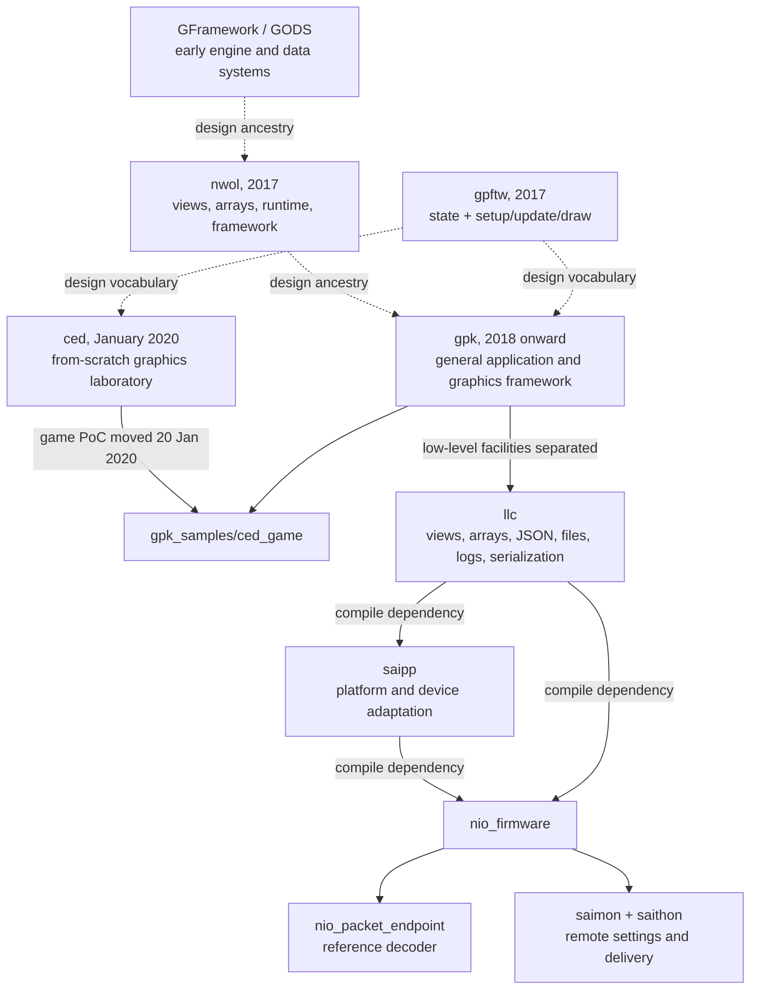
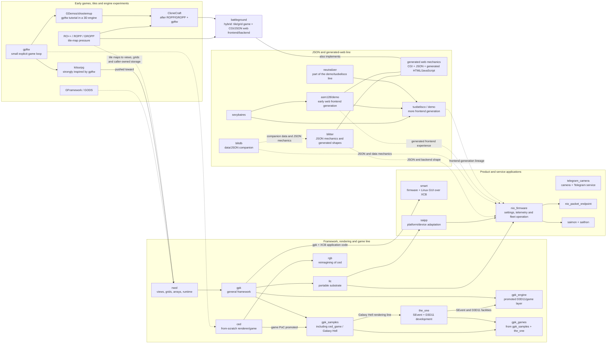

# Lineage from the early engines and games to `gpk`, `llc` and the SpaceAI firmware

## The short answer

The firmware is not an isolated body of embedded code. It is the latest application of an architecture that can already be seen developing through the `GFramework`/`GODS`, `nwol`, `gpftw`, `gpk` and `ced` generations.

The relationship has two different forms:

1. **Direct dependency:** `nio_firmware` compiles against `saipp` and `llc`. `saipp` includes `llc_arduino.h` and deliberately re-exports the `llc` containers, views, strings, pointers, error types, enums and numeric types under the `sai` vocabulary.
2. **Design lineage:** `GODS`, `nwol`, `gpftw`, `ced` and the higher layers of `gpk` are not firmware dependencies, but they contain earlier versions of the same state organization, lifecycle decomposition, caller-owned storage, view-based access, data pipelines and extraction process.

This distinction matters. The firmware does not carry a graphics engine into an ESP32 build. It reuses the low-level part that survived the graphics experiments and applies the same method to a different domain.

### Core dependency line



Solid arrows show a source movement, compile-time dependency or protocol relationship. Dotted arrows show a design relationship.

### Expanded development lineage

The larger map includes the game, rendering, web-generation and product experiments that fed the core line. These relationships were supplied and confirmed by the author; repository history supplies the dated anchors where Git history is available.



`battleground` is deliberately outside either single branch because it joins them. Its core uses grid/view-based tile state, while `mineback` exposes a CGI/JSON game service and `minefront` generates HTML and JavaScript, relays HTTP requests and turns backend JSON into the browser board. The arrowless connection to “generated web mechanics” denotes that combined implementation rather than a claim that one repository evolved into the other.

`telegram_camera` is intentionally shown without a causal arrow. It is part of the development timeline, but no successor or influence relationship was specified here. `smart` has a directly observable `gpk`/XCB implementation relationship; the diagram does not claim that it directly became NIO. The dotted web-to-NIO arrows express design influence rather than copied source.

## Chronology and concrete evidence

| Date | Evidence | Meaning |
| --- | --- | --- |
| Before 2017 | Archived `GFramework`/`GODS` code | The earlier engine generation explores generic buffers, reference management, type metadata and framework ownership. Its archive does not provide one clean Git chronology, so it is treated as background rather than dated proof. |
| 23 March 2017 | First `nwol` commit | `array_view`, `array_pod`, `array_obj`, `grid_view`, managed pointers, JSON, runtime values, application modules and `SFramework` are already present in this generation. |
| 3 May 2017 | First available `kitsurpg` commit | The game branch influenced by `gpftw` develops toward the structures later formalized in `nwol` and `gpk`. Repository import dates do not necessarily equal the first date of the underlying work. |
| 11 June 2017 | First `gpftw` commit | The early tutorials already group state in `SGame` and divide the frame into `setup`, `update` and `draw`. |
| 18 May 2018 | First `gpk` commit | The reusable framework branch begins. |
| July-August 2019 | `blitter`, `blitdb`, `battleground`, `neutralizer` and `demo` repositories begin | The JSON/database experiments and generated-web line become separate projects. `battleground` joins that work to grid/view-based tile state through a CGI/JSON backend and generated browser frontend. |
| 8 January 2020 | `ced` adds `view` and `container` during its first day | A minimal graphics project becomes a laboratory for rebuilding only the facilities demanded by the growing demo. |
| 18 January 2020 | `ced` extracts common framework code into `SFramework` | Window, pixels, double buffers, depth, timing and execution state become a reusable application boundary. |
| 20 January 2020 | `gpk_samples` commit `3bb8876`: “Moved game PoC from CED repository” | This is a direct bridge: the experiment is promoted into a `gpk` application instead of remaining a disposable demo. |
| 1 April 2021 | `gpk` commit `da6531c`: “Moved gpk_framework.* to llc” | The repository starts separating low-level/common facilities from higher-level application code. |
| April 2022 | `telegram_camera` develops from concept to separated camera/bot integration | A compact Python service combines capture, sessions, bot control, video responses, logging and remote interaction. It remains a parallel application in this map. |
| July-September 2022 | `rgb_tutorial` and `rgblib` | The `ced` rendering exercise is reimagined and reusable raster/window operations are promoted into a library. |
| September 2022 | `gpk_games` begins with `galaxy_hell` | The game/application repository continues work that had lived in `gpk_samples`. |
| December 2022-January 2023 | `the_one` code enters `gpk_games`; D3D11 support is cleaned, completed and promoted | The event and D3D11 work becomes the basis of the `gpk_engine` layer while `gpk_games` combines the `gpk_samples` and `the_one` branches. |
| 17 October 2023 | Original firmware commit `28f55db` adds the `llc` dependency | The embedded product begins consuming the common layer directly. |
| 1 March 2024 | First `saipp` commit | Device and platform-specific facilities get their own layer above `llc`. |
| 15 April 2024 | First `FirmwareWorks` commit | Firmware and its reusable dependencies become a coordinated workspace. |
| 20 September 2026 | Current local `gpk` and standalone `llc` revisions | The two layers continue independently: `gpk` carries applications and graphics; `llc` carries the reusable substrate. |

The current `gpk_view.h` and `llc_view.h` make the extraction especially visible. Their layout and behavior are substantially the same, including `Data`/`Count`, slices, iteration, searches, equality and the Android/C++20 compatibility comment. The namespace, format tokens and surrounding low-level facilities have been separated and continued independently.

## What each project contributed

| Project | Role in the lineage | What remains visible in the firmware |
| --- | --- | --- |
| `GFramework` / `GODS` | Early general engine and data-system experiments | Explicit buffers and managers, data descriptions, ownership machinery and the attempt to make one infrastructure serve many application domains. |
| `nwol` | Mature predecessor to the later low-level/framework split | `array_view`, separate POD/object arrays, grid views, managed pointers, JSON, signed errors, runtime values, application modules and composed framework state. |
| `gpftw` | Early teaching and architecture vocabulary | Explicit aggregate state, named setup/update/draw phases, small subsystem functions, const read-only drawing inputs and aligned families of operations. |
| `gpk` | Generalization into a reusable framework | Application/framework boundaries, typed data structures, views and arrays, diagnostics, JSON, platform wrappers, dependency layering and shared implementation behind convenient entry points. |
| `ced` | A deliberately small, from-scratch proving ground | Add infrastructure only when the application demands it; caller-owned pixel/depth caches; data-oriented parallel arrays; small rendering stages; rapid promotion of repeated code into common files. |
| `llc` | Distillation of the generally reusable low-level layer | `view`, `apod`, `aobj`, `astatic`, `pobj`, strings, JSON, serialization, files, paths, enum support, error propagation, logging, time and platform support. |
| `saipp` | Adaptation of that substrate to the SpaceAI domain | Arduino/ESP32 integration, filesystem and SPI helpers, platform types, safe strings, MAC and pin types, while retaining `llc` ownership and error conventions. |
| `nio_firmware` | Product application of the method | Explicit device state, short tick functions, configurable hardware, packed records, reusable buffers, local administration, telemetry, sleep, OTA and remote management. |

## The same architecture at increasing scale

Before the compact `ced` implementation, `nwol` already contains much of the type vocabulary that later becomes familiar in `gpk` and `llc`: non-owning array views, separate POD and object arrays, grid views, pointer wrappers, JSON trees, signed errors, runtime values and application modules. It also composes display, input, GUI and network facilities into `SFramework`.

This makes `nwol` a stronger low-level ancestor than `gpftw`. The role of `gpftw` is different: it exposes the application organization in a small teaching example where the state and frame phases are easy to see. `ced` then shows how little machinery is actually required to rebuild a functioning graphics stack, while `gpk` and `llc` carry the reusable versions forward.

### 1. State is made explicit

`gpftw` groups the map, player, enemies and shots in `SGame`, then passes that state to operations:

```cpp
struct SGame {
    SMap                     Map;
    SCharacter               Player;
    ::std::vector<SCharacter> Enemy;
    ::std::vector<SShot>      Shots;
};

void setup (SGame * gameObject);
void update(SGame * gameObject, float secondsLastFrame);
void draw  (const SGame * gameObject);
```

`ced` advances the same idea by composing reusable execution state into application state:

```cpp
struct SApplication {
    ::ced::SFramework Framework = {};
    ::ssg::SSolarSystem SolarSystem = {};
    STextOverlay TextOverlay = {};
};
```

The firmware uses the same structure at product scale. `NIO` owns loop timing, the web server, updater, hardware interfaces, queues and operational parameters. Its `get()` method provides one lifetime-controlled instance, while `setup()`, `loop()` and the `tick...()` functions operate on that state.

The surface syntax changed from passed pointers to a controlled singleton because Arduino supplies fixed `setup()` and `loop()` entry points. The underlying rule did not change: state has a named owner and subsystem functions do work on that state.

### 2. Raw storage evolves into views plus ownership

`gpftw` still uses fixed arrays, `std::vector` and pointer parameters. On the first day of `ced`, the demos introduce two deliberately separate concepts:

- `view<T>`: `Data` plus `Count`, providing access without ownership.
- `container<T>`: storage ownership and resizing, derived from the view interface.

That separation becomes more precise in `gpk` and then `llc`:

- `view<T>` describes existing elements.
- `apod<T>` owns POD storage.
- `aobj<T>` owns object storage.
- `astatic<T, N>` stores a fixed-capacity array.
- `pobj<T>` controls an object's lifetime.

`saipp` does not wrap these in a second container implementation. It aliases them:

```cpp
template<typename T> using vector = aobj<T>;
template<typename T> using array  = apod<T>;
template<typename T> using ptr    = pobj<T>;
typedef view<const byte> byte_view;
typedef array<byte>      byte_array;
```

The firmware can consequently treat a packet as owned bytes while it is being assembled and as a non-owning `byte_view` while it is being decoded. `loadView()` advances through existing serialized storage without allocating another copy. This is the embedded form of the same ownership/access separation used for pixels, geometry and depth buffers in `ced`.

### 3. The frame pipeline becomes a device pipeline

In `ced`, a frame is a sequence of small stages over explicit buffers:

```text
update time and state
    -> clear/reuse drawing caches
    -> transform geometry
    -> rasterize coordinates and weights
    -> shade pixels
    -> publish the completed buffer
```

In the firmware, the domain changes but the shape remains recognizable:

```text
tick sensors and communications
    -> append a record header
    -> append selected typed sections
    -> wrap the record in a packet
    -> transmit or retain it
    -> decode the same sections at the endpoint
```

For example, `appendSections()` accepts a view of section identifiers and appends GPS, IMU, capacity or ADS data to caller-owned packet storage. `sectionToJSON()` performs the inverse operation by consuming a byte view. The Python `nio_packet_endpoint` independently expresses the receiving side of that contract.

This is not graphics code reused as telemetry code. It is the same technique: a sequence of narrow transforms over explicit representations, with storage and policy supplied by the caller.

### 4. Repeated work is promoted at the moment it earns a name

The histories show a recurring extraction rhythm:

1. Put the simplest useful implementation in the application.
2. Let real uses expose the common operation.
3. Move the repeated operation to a focused file or library.
4. Keep the application-specific state above that boundary.

`ced` demonstrates this within days: window code, views, containers, geometry, image loading, drawing and framework state are extracted as the demos demand them. The game proof of concept is then moved to `gpk_samples` and adapted to `gpk` types.

The firmware repeats the process over a longer product cycle. Filesystem, strings, time, SPI and platform definitions move to `saipp`; common Python functions move to `saithon`; the remote service becomes `saimon`; and packet decoding becomes `nio_packet_endpoint`.

The resulting modularity was discovered from working code. It was not paid for through a speculative hierarchy created before the problem was understood.

### 5. Compile-time constants become typed runtime data

`gpftw` contains tutorial-era definitions such as `MAX_MAP_WIDTH`, `TILE_GRASS`, `INVALID_ENEMY` and `GAME_PI`. Later code replaces this style according to what each value means: typed constants, enums, structure members, function parameters or settings.

The firmware takes this much further. GPIO assignments, I2C addresses, UART pins, feature choices, sleep intervals, network behavior and communication policy live in typed settings. The same data participates in JSON loading, saving, generated local forms, remote comparison and device-specific updates.

That change connects directly to the earlier library work:

- `llc` supplies typed enums, views, strings, JSON and serialization.
- `saipp` supplies platform meanings such as `PIN_MODE`, MAC types and ESP32 variants.
- `nio_firmware` supplies the product policy and the actual settings groups.
- `saimon` changes those values remotely without creating a new source branch or firmware variant for every supported installation.

The general principle found in the older code therefore has a measurable product effect here: represent choices as data when the language can express them, then let tools and runtime systems operate on that data.

### 6. Failure handling scales with the same call shape

The later `gpk`/`llc` code standardizes signed results, contextual diagnostics and immediate propagation. The firmware retains that calling convention:

```cpp
fail_if_failed(appendRecordHeader(outputBytes));
return appendSections(outputBytes, sections);
```

This lets a high-level operation remain a readable list of work while the failing layer records the local evidence. The debug build can additionally stop at the exact failed check; the release build can report the same contextual chain and continue according to product policy.

The convention is especially valuable in the firmware because one transaction crosses filesystem, sensor, network, serialization and power-management boundaries. A uniform result type allows those layers to compose without a separate exception, callback or status convention for each library.

## Why the firmware depends on `llc`, not on all of `gpk`

This is one of the best pieces of architectural evidence in the whole system.

The firmware needs arrays, views, strings, JSON, serialization, files, errors and platform helpers. It does not need a desktop window, GUI controls, rasterization, a render target or a game framework. Because the common facilities were separated, PlatformIO can include `../llc` and `../saipp` without pulling the high-level `gpk` application stack into the device.

If those facilities had remained methods buried inside graphics classes, the firmware would either duplicate them or inherit irrelevant dependencies. The present dependency graph shows that the ownership boundary works in practice.

The inverse is also useful: `gpk` can continue building games and graphical tools on the same family of lower-level types, while the embedded application can optimize allocation growth and platform behavior for constrained hardware.

## What the relationship says about development speed

The firmware was new product work, but it was not intellectually started from zero. It inherited years of accumulated decisions:

- how state should be grouped;
- how work should be split into small phases;
- how ownership differs from access;
- how results and diagnostics compose;
- how representations should be serialized;
- when common code has earned extraction;
- how platform-specific policy should sit above a portable base.

This is reusable engineering capital. `ced` shows how quickly a renderer and game can grow when those decisions are available. The firmware shows the same effect in a much less forgiving domain: several boards, sensors, radios, filesystems, sleep states, local administration, packed telemetry and remote deployment.

The strongest productivity claim is therefore not merely that many lines were written quickly. It is that each project reduced the number of decisions, implementations and failure modes that the next project had to pay for again.

## Limits of the claim

The direct relationships are verifiable in the repositories: build dependencies, moved files, near-identical low-level implementations and protocol pairs. The conceptual relationships are architectural readings of the code. They should not be described as literal copy history unless Git records or file comparisons establish that fact.

The most defensible description is:

> `GFramework`/`GODS` explored the general engine, `nwol` established much of the reusable type and runtime vocabulary, `gpftw` exposed the application pattern in a small form, `gpk` generalized it, `ced` stress-tested and simplified it, `llc` distilled the portable substrate, and the SpaceAI system applied that substrate and method to embedded hardware and fleet operations.

## Sources reviewed

- `D:/dev_extras/asm128/gpftw`
- `D:/dev_extras/Repos_2015_12_15/Jesus/GFramework`
- `D:/dev_extras/Repos_2015_12_15/Jesus/GODS`
- `D:/dev_extras/Repos_2015_12_15/ROPP`
- `D:/dev_extras/Repos_2015_12_15/Jesus/CloneCraft`
- `D:/dev_extras/Repos_2015_12_15/Jesus/GDemos/shootemup`
- `D:/dev_extras/asm128/nwol`
- `D:/dev_extras/asm128/kitsurpg`
- `D:/dev_extras/asm128/battleground`
- `D:/dev_extras/asm128/ced`
- `D:/dev_extras/rgb`
- `D:/dev_extras/asm128/gpk`
- `D:/dev_extras/asm128/gpk_samples/ced_game`
- `D:/dev_extras/asm128/the_one`
- `D:/dev_extras/asm128/gpk_games`
- `D:/dev_extras/asm128/llc`
- `D:/dev_extras/asm128/blitter`
- `D:/dev_extras/asm128/blitdb`
- `D:/dev_extras/asm128/demo`
- `D:/dev_extras/asm128/neutralizer`
- `D:/dev_extras/sexybaires`
- `D:/dev_extras/tuobelisco`
- `D:/dev_extras/smart`
- `D:/dev_extras/telegram_camera`
- `D:/dev_extras/Firmware_Main_SpaceAI`
- `D:/dev_extras/FirmwareWorks/llc`
- `D:/dev_extras/FirmwareWorks/saipp`
- `D:/dev_extras/FirmwareWorks/nio_firmware`
- `D:/dev_extras/FirmwareWorks/nio_packet_endpoint`
- `D:/dev_extras/FirmwareWorks/saithon`
- `D:/dev_extras/FirmwareWorks/saimon`
